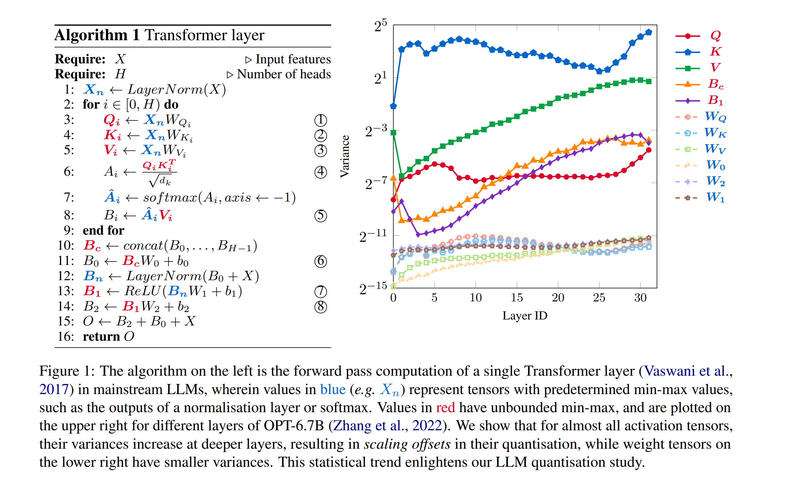

# Revisiting Block-based Quantisation: What is Important for Sub-8-bit LLM Inference?

[\[EMNLP2023\]](https://arxiv.org/abs/2310.05079)

This repo serves as the implementation of the EMNLP2023 paper *Revisiting Block-based Quantisation: What is Important for Sub-8-bit LLM Inference?*

## Overview



The inference of Large language models (LLMs) requires immense computation and memory resources. To curtail these costs, quantisation has emerged as a promising solution, but existing LLM quantisation mainly focuses on 8-bit. In this work, we explore the statistical and learning properties of the LLM layer and attribute the bottleneck of LLM quantisation to *numerical scaling offsets*. To address this, we adapt block quantisations for LLMs, a family of methods that share scaling factors across packed numbers. Block quantisations efficiently reduce the numerical scaling offsets solely from an arithmetic perspective, without additional treatments in the computational path. Our nearly-lossless quantised 6-bit LLMs achieve a $19\times$ higher arithmetic density and $5\times$ memory density than the float32 baseline, surpassing the prior art 8-bit quantisation by $2.5\times$ in arithmetic density and $1.2\times$ in memory density, without requiring any data calibration or re-training. We also share our insights into sub-8-bit LLM quantisation, including the mismatch between activation and weight distributions, optimal fine-tuning strategies, and a lower quantisation granularity inherent in the statistical properties of LLMs. The latter two tricks enable nearly-lossless 4-bit LLMs on downstream tasks.

## Setup

Conda environment is recommended. To create a conda environment, run:

```bash
cd llm-mixed-q
conda env create -f environment.yml
```

## Features

* Supported model architectures:
  + BERT
  + OPT
  + Llama

* Compatible with HuggingFace Transformers. Checkpoints of supported model architecture from HuggingFace Transformers can be loaded, quantised, and evaluated.

* Supported quantisation (software-emulated):
  + Symmetric fixed-point
  + Logarithmic
  + Minifloat
  + De-normalized minifloat (DMF)
  + Block Logarithmic (BL)
  + Block Floating Point (BFP)
  + Block Minifloat (BMF)

* Search algorithms are supported by [Optuna](https://optuna.readthedocs.io/en/stable/index.html)
  + Random
  + TPE
  + NSGA-II
  + NSGA-III
  + QMC

## Entry points

```bash
git clone https://github.com/ChengZhang-98/llm-mixed-q.git
```

### Section 1: Variance vs Layer number plot

This example plots the variance plot of Vicuna-7B.

```bash
cd llm-mixed-q/experiments/emnlp/section_1/profile_variance
python profile.py
```

### Section 4.2 Uniform quantisation

* **PTQ on Wikitext2**

  This example evaluate W6A6 BFP llama models on Wikitext2.

```bash
cd llm-mixed-q/experiments/emnlp/section_4.2/perplexity
./group_bfp_6bit.sh
```

* **PTQ on downstream tasks**

  This example evaluate W6A6 BFP llama models on downstream tasks in 0-shot prompting style.

```bash
cd llm-mixed-q/experiments/emnlp/section_4.2/downstream
./group_bfp_6bit.sh
```

### Section 4.3 Fine-tuning uniform 4-bit BFP

This example fine-tunes W4A4 BFP OPT-350M on SST-2.

```bash
cd /experiments/emnlp/section_4.3
./opt_350m_sst2.sh
```

### Section 4.4 Mixed-precision BFP search

```bash
cd llm-mixed-q/experiments/emnlp/section_4.4
# this bash script requires a string tag and a search config toml
./opt_1.3b_sst2.sh dummy-tag llm-mixed-q/experiments/emnlp/configs/search/opt_1.3b_sst2.toml
```

## Citation

```bibtex
@article{zhang2023revisiting,
  title={Revisiting Block-based Quantisation: What is Important for Sub-8-bit LLM Inference?},
  author={Zhang, Cheng and Cheng, Jianyi and Shumailov, Ilia and Constantinides, George A and Zhao, Yiren},
  journal={arXiv preprint arXiv:2310.05079},
  year={2023}
}
```
